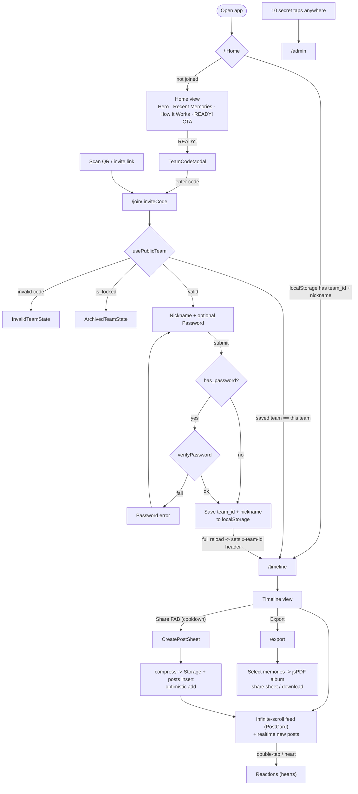
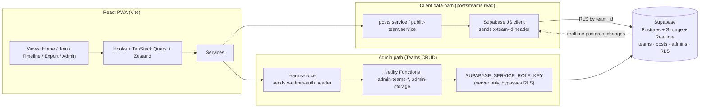

# Memory Trip — App Flow

## User Flow (routing + security paths)

## Architecture & Data Security Layers

## Notes

- **Home** auto-redirects joined users (localStorage `team_id` + `nickname`) to
  `/timeline`; otherwise the READY! CTA opens `TeamCodeModal`.
- **Join** (`usePublicTeam`) handles invalid/locked teams, the returning-user
  shortcut, optional password verification, then saves to localStorage and does
  a **full page reload** so the Supabase client picks up the `x-team-id` header.
- **Timeline** uses infinite scroll + a realtime subscription, a cooldown-gated
  Share FAB feeding `CreatePostSheet`, and an Export route producing the jsPDF
  album.
- **Two security layers**: client reads go through the Supabase JS client with
  `x-team-id` (RLS-enforced); all admin Teams CRUD goes through **Netlify
  Functions** with `x-admin-auth`, using the service-role key server-side to
  bypass RLS. Admin is reached via the 10-tap secret entry.
