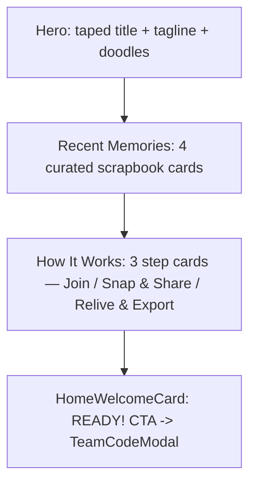

# Home Page Upgrade — "More Approachable" Plan

## Problem

The home page is the landing surface for visitors who haven't joined a team yet
(joined users auto-redirect to `/timeline`). Today it has a hero, 3 hardcoded
"Recent Memories" cards, and a welcome/CTA card. It's pleasant but doesn't
clearly explain **what the app is** or **how to start**, and the first
impression could feel warmer and more polished.

Goal: a full, in-theme landing refresh (visual + onboarding clarity + warmth),
no new dependencies, mobile-first.

## Requirements (from Q&A)

- **1=d** — Full landing-page refresh: visual appeal + onboarding clarity +
  trust/warmth.
- **2=a** — Keep "Recent Memories" as a static curated showcase (make it
  prettier/more believable), and **add a guideline / "how it works" section**.
- **3=a** — Minimal: reuse existing components and theme tokens, no new
  dependencies, mobile-first.

## Background (codebase findings)

- Theme "Summer Scrapbook" (`THEME.md`, `src/style.css`): pastel palette
  (`primary` sky, `secondary` teal, `accent` yellow, `peach`, `coral`, `mint`,
  `sand`), `font-handwritten` (Pangolin), `font-rounded` (Varela Round), shadows
  (`shadow-polaroid`, `shadow-sticker`), animations (`animate-float`,
  `animate-bounce-slow`, `animate-pop`).
- Reusable primitives already exist:
  - `AppLayout`, `MasonryGrid`, `CenteredContent` — `src/components/layout/layout-primitives.tsx`
  - `Float`, `Pop`, `Tape` — `src/components/animation/animation-utils.tsx`
  - `MemoryPostCard` — `src/components/memory/memory-post-card.tsx`
  - `ImageFrame`, `Badge` (variants `nickname`/`tag`), `Button` (variants
    `sticker`/`accent`/`outline`), `Divider` — `src/components/ui/*`
- `HomeWelcomeCard` (`src/components/home/home-welcome-card.tsx`) already handles
  the randomized greeting + "READY!" CTA -> `TeamCodeModal`, plus the contact
  email. Keep as the closing CTA.
- The 3 steps map to real features: **Join** (TeamCodeModal), **Snap & Share**
  (timeline upload), **Relive & Export** (timeline + finished PDF album export).

## Proposed Solution

Restructure `src/views/home.tsx` into four scrapbook sections, top-to-bottom,
reusing existing primitives:

1. **Hero (header)** — keep taped "Memory Trip" title + tagline; add a short
   value-prop subtitle and 1-2 subtle floating doodles.
2. **Recent Memories showcase** — keep static, make believable: 4 curated cards
   (3 photo + 1 handwritten note), consistent captions/authors/dates, gentle
   alternating rotations via `MemoryPostCard`/`MasonryGrid`.
3. **NEW "How It Works"** — one new component: a 3-step row of in-theme step
   cards (numbered washi-tape/`Badge` marker + emoji + handwritten title +
   one-line description): Join -> Snap & Share -> Relive & Export. Stacks
   vertically on mobile, 3 columns on `md+`.
4. **Welcome/CTA (footer)** — keep `HomeWelcomeCard` unchanged.

Only **one new file** (`src/components/home/home-how-it-works.tsx`) plus edits to
`home.tsx`. Everything else is reuse.

## Tasks

### Task 1: Create the "How It Works" step section component

- Add `src/components/home/home-how-it-works.tsx` exporting `HomeHowItWorks` — a
  3-step explainer using only existing theme tokens/components. Each step: a
  numbered washi-tape/`Badge` marker, an emoji, a bold `font-handwritten` title,
  a one-line `font-rounded` description. Content: 1) Join your team (enter the
  code), 2) Snap & share (post photos and notes), 3) Relive & export (browse the
  timeline and save a PDF album). Responsive: single column on mobile, 3 columns
  on `md+`. Wrap with `Pop`/`Float`.
- Mirror styling in `home-welcome-card.tsx` and `memory-post-card.tsx`. No new
  deps; data is a small local array.

### Task 2: Refresh the Recent Memories showcase content

- In `home.tsx`, keep the section static but more believable: 4 cards (3 photo +
  1 handwritten note), consistent realistic captions/authors/dates, gentle
  alternating rotations, plus a warm one-line intro under the heading.
- Keep using `MasonryGrid` + `MemoryPostCard`; only adjust props/content. Keep
  existing Unsplash demo images. No backend wiring (per 2=a).

### Task 3: Restructure + polish hero and wire it together

- Update `home.tsx` to compose all four sections in order (hero -> recent
  memories -> `HomeHowItWorks` -> `HomeWelcomeCard`), add a short value-prop
  subtitle + 1-2 subtle floating doodles to the hero, ensure spacing/dividers
  read as one cohesive page. Preserve the joined-user redirect and
  `TeamCodeModal` join flow.
- Reuse `AppLayout` header/footer slots, `Divider variant="dashed"` between
  sections, `Float`/`Tape` for hero polish. Minimal changes.

## Verification

- Run `pnpm build` (tsc + vite) after changes; fix type errors.
- Manually verify mobile-first (single-column) + desktop layouts, the "READY!"
  join modal flow, and the joined-user redirect to `/timeline`.

## Out of Scope (future)

- Making Recent Memories dynamic from the backend (deferred per 2=a).
- New animations/illustrations beyond existing theme primitives.
