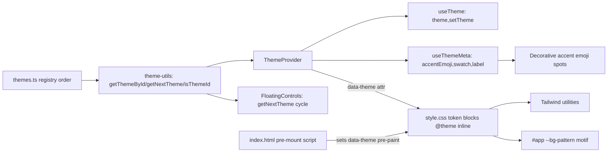

# Plan: Per-User Theme Moods

## Problem Statement

Add a fixed set of selectable visual "moods" (Summer, Sunset, Ocean, Forest) chosen
per-device by each user. A mood changes the color palette, the background pattern motif + color, and a
decorative accent emoji in a few signature spots. Persisted in localStorage, cycled from
FloatingControls. Export is unaffected. Adding another mood must require only data/CSS, never
application-logic changes.

## Requirements (confirmed)

- Per-user, per-device; persisted to localStorage; extends existing `summer`/`sunset` model.
- Palette + named mood + matching background motif + a decorative accent emoji (icon-level, not font
  family).
- Set: Summer, Sunset, Ocean, Forest (4). (A dark "Night" mood was considered and removed for
  legibility — all moods are light.)
- Switcher in `FloatingControls`, beside language, cycling through moods — **cycle order derived from
  the registry, never hardcoded**.
- Export stays as-is.
- **Acceptance:** a 5th mood = one registry entry + one `[data-theme]` CSS block + two i18n label keys
  (en + vi `common.json`), with zero application-logic edits.

## Background (from code investigation)

- `ThemeProvider` exists (`summer`/`sunset`), sets `data-theme` on `<html>` in a post-paint
  `useEffect`, **not persisted**, resets on reload. No switcher UI currently mounted (only language in
  `FloatingControls`).
- **Token-wiring bug in `style.css` (confirmed):** `@theme` defines `--color-*` literals
  (`--color-primary: #87ceeb`, etc.) while `:root` defines a _separate_ set (`--primary`, `--secondary`,
  …) and `[data-theme='sunset']` overrides only that separate set. Tailwind utilities resolve
  `--color-*`, so they never respond to theme. Must bridge `@theme` tokens to runtime vars first
  (see Task 1 for the exact Tailwind v4 mechanism).
- **Latent `--bg` bug (confirmed):** `#app { background: var(--bg); }` references a variable that is
  **never defined**, so `#app` is currently transparent. This is the _only_ reason the `body` dot
  pattern shows through on mobile (where `#app` fills the viewport). Any change that gives `#app` an
  opaque background will hide the themed motif on mobile — the primary platform. See Task 1 / Task 3.
- Background motif is one line on `body`:
  `background-image: radial-gradient(var(--color-sand) 1px, transparent 1px)`.
- **Decorative emoji are widespread.** Grep audit of ✨:
  - i18n strings: `home.json` (brandTagline, iceCream, howItWorks title), `join.json`
    (tagline, tooltip, error), `share.json` (title), `timeline.json` (`headerTagline`, `heartHint`).
  - components: `home-welcome-card.tsx`, `memory-post-card.tsx`, `PostCard.tsx`, `EmptyTimelineState.tsx`.
  - Theming scope (decision): only `EmptyTimelineState` and the timeline header tagline swap to the
    mood accent emoji. **All other ✨ spots stay static by design** (see Task 6 rationale) to keep the
    change set small. Semantic emoji (📦 closed, 👋 quit) must NOT be themed.
- **Hardcoded-color audit (timeline):** only the heart colors are non-semantic —
  `HeartTooltip` `bg-rose-500` (incl. the arrow `bg-rose-500`), `HeartButton`
  `fill-rose-500 stroke-rose-500` + `text-rose-600`. The `red-*` usages (`QuitTeamDialog`,
  `TimelineHeader` quit item) are semantic-destructive and stay. The `views/timeline` view is already
  token-clean. Note `HeartButton` also uses an opacity modifier (`text-text/60`) — Task 1 must confirm
  opacity modifiers still theme correctly.
- `STORAGE_KEY` in `utils/constants.ts` (no `THEME` key yet — theme was never persisted, so no
  migration needed); storage helper in `utils/storage.ts` (JSON round-trip, safe parse fallback).
- An automated test already exists: `components/layout/floating-controls.test.tsx`. The new theme
  button must not break it and the cycle behavior should be added to it (Task 5).
- This is a **PWA**: `:root` sets `color-scheme: light` and there is a `<meta name="theme-color">`.
  All moods are light, so the PWA `theme-color` is synced to the active mood's surface (Task 4); no
  dark `color-scheme` handling is needed.
- Tests use vitest + i18n parity, per existing `*.test.tsx` style; `i18n/parity.test.ts` enforces
  identical en/vi key sets.

## Proposed Solution

A single ordered theme registry is the source of truth (`{ id, labelKey, swatch, accentEmoji }`). A
thin theme-utility module (`getThemeById`, `getNextTheme`, `isThemeId`) centralizes all
lookup/cycle/validation logic; `ThemeProvider` and `FloatingControls` consume only these helpers — no
duplicated or hardcoded ordering. `ThemeProvider` exposes `useTheme()` → `{ theme, setTheme }` and a
separate `useThemeMeta()` → active metadata. `style.css` bridges `@theme` tokens to runtime vars using
`@theme inline`, adds a `[data-theme]` block per mood, and a `--bg-pattern` var rendered on the
`#app` container (so the motif is visible on mobile and desktop). A pre-mount inline script in
`index.html` applies the persisted `data-theme` before first paint to avoid a flash. Decorative accent
emoji come from `useThemeMeta().accentEmoji`.

## Task Breakdown

### Task 1: Fix token wiring so `data-theme` drives Tailwind utilities

- Objective: Make `data-theme` actually retint `bg-primary`/`text-surface`/`border-border`/etc.,
  including opacity-modified utilities.
- In `style.css`, use **`@theme inline`** for the color tokens so utilities resolve the runtime var at
  the use site (e.g. `--color-primary: var(--primary)`), rather than baking the literal into `:root`.
  This is the documented Tailwind v4 pattern for `data-attribute` theme switching; a plain `@theme`
  block keeps the double indirection and risks opacity modifiers / `color-mix` not following the theme.
- Ensure `:root` defines the full runtime set utilities depend on
  (`--surface`, `--card`, `--border`, `--text`, `--text-h`, `--primary`, `--secondary`, `--accent`,
  and the motif color, e.g. `--sand`).
- **Fix the latent `--bg` bug:** `#app` references undefined `--bg`. Decide explicitly — keep `#app`
  transparent (so the `body`/`#app` motif shows) or set it to `--surface`. This decision is coupled to
  Task 3 (where the motif lives). Do not leave a dangling var.
- **Exit criteria (must verify in devtools before moving on):** toggling `data-theme="sunset"` live
  recolors `bg-primary`, `text-text/60` (opacity modifier), and `border-border` across the timeline
  (FAB, banners, header) — not stray elements only. If utilities don't retint, the `@theme inline`
  wiring is wrong; stop and fix before any downstream task.
- Demo: flipping `data-theme` live visibly retints the whole UI, opacity-modified utilities included.

### Task 2: Theme registry + theme-utility module (+ unit tests)

- Objective: Single source of truth for themes and all lookup/cycle/validation logic.
- Add `src/components/theme/themes.ts`: ordered array of `{ id, labelKey, swatch, accentEmoji }` for
  summer, sunset, ocean, forest (`accentEmoji` explicitly decorative-only).
- Add `src/components/theme/theme-utils.ts`: `getThemeById(id)` (fallback to first/summer on miss),
  `getNextTheme(id)` (registry-order, wraps Forest→Summer), `isThemeId(value)`.
- Test (vitest): valid lookup; invalid lookup → fallback; `isThemeId` true/false; `getNextTheme`
  advances in registry order and wraps Forest→Summer.
- Demo: unit tests pass, proving cycle/validation behavior independent of any component.

### Task 3: New palettes + per-theme background motif in CSS

- Objective: Add Ocean/Forest palettes and themed backgrounds, visible on mobile and desktop.
- In `style.css`, add `[data-theme='ocean'|'forest']` token blocks (keep summer default /
  sunset). Introduce `--bg-pattern` with a per-theme motif.
- **Render `--bg-pattern` on the `#app` container** (`background-image: var(--bg-pattern)`), not only on
  `body`. On mobile `#app` fills the viewport, so a `body`-only pattern would be hidden. If `#app` also
  needs a solid surface, layer it (e.g. `background: var(--bg-pattern), var(--surface)`). Keep `body`'s
  background for the desktop side-margins as a solid mood surface.
- **Implementation guidance:** prefer lightweight CSS gradients/patterns so each mood is a single
  `[data-theme]` block (keeps the data/CSS-only acceptance promise). Use SVG data-URI only where a
  gradient can't express the motif; note that SVG data-URIs **cannot reference `var(--…)`** and must be
  URL-encoded, so an SVG motif needs one encoded asset per mood. If used, validate Safari rendering on
  desktop + mobile.
- All moods are light, so no per-theme `color-scheme` handling is required.
- Test: manual — each `data-theme` yields a distinct palette + background across Chrome + Safari
  (desktop + mobile), motif visible on mobile.
- Demo: all 4 values show visually distinct, cross-browser-correct moods on mobile and desktop.

### Task 4: Persisted ThemeProvider over the registry/utils, no-flash init (+ tests)

- Objective: Drive theme from registry, support all 4 ids, persist per-device, with refined API and no
  flash on reload.
- Refactor `theme-provider.tsx`: `Theme` = registry ids; initialize `useState` from
  `storage.get(STORAGE_KEY.THEME)` validated via `isThemeId`, else first registry theme; **add
  `STORAGE_KEY.THEME`** to `constants.ts`. Always set `data-theme` (incl. summer); persist on change;
  expose `useTheme()` → `{ theme, setTheme }` and `useThemeMeta()` → active metadata via
  `getThemeById`. Do **not** expose the raw registry entry through `useTheme`.
- Apply the `data-theme` attribute synchronously (`useLayoutEffect` or directly) to minimize the wrong
  paint, and add a tiny **pre-mount inline script in `index.html`** that reads the persisted value and
  sets `data-theme` (and `theme-color`) on `<html>` before React mounts — eliminating the
  flash-of-default-theme on reload. Keep the script registry-agnostic (just reads the
  string; falls back gracefully on unknown values, with `ThemeProvider` doing authoritative validation).
- Test (vitest): setting a theme persists to storage and reads back on re-mount; an invalid stored
  value falls back to summer; `useThemeMeta` returns the active entry.
- Demo: pick a mood, reload, mood persists with no flash; a corrupt stored value safely defaults.

### Task 5: Theme cycle button in FloatingControls + hardcoded-color cleanup (+ i18n + tests)

- Objective: Let users switch moods, cycling derived from the registry, with consistent recoloring.
- In `floating-controls.tsx`, add a button beside language that computes the next theme via
  `getNextTheme(theme)` (never a hardcoded order) and shows the active mood's swatch/`accentEmoji`;
  `aria-label` announces the next mood label.
- Add the 4 mood label keys to the `common` namespace, **en + vi** (parity test enforces both).
- **Color cleanup (from audit):** introduce a `--color-heart` token in the `@theme inline` block (with
  per-`[data-theme]` overrides) and replace the heart rose classes with theme utilities —
  `HeartTooltip` `bg-rose-500` → `bg-heart` (incl. the arrow), `HeartButton`
  `fill-rose-500 stroke-rose-500` → `fill-heart stroke-heart`, `text-rose-600` → `text-heart`. Leave
  semantic-destructive `red-*` in `QuitTeamDialog`/`TimelineHeader` untouched.
- **Update `floating-controls.test.tsx`:** keep the language assertion working with the added button,
  and add a cycle test — clicking the theme button advances through all four in registry order and
  wraps Forest→Summer (assert `document.documentElement` `data-theme` and the persisted storage value).
- Test: clicking cycles through all four in registry order and wraps; hearts retint per mood; build +
  i18n parity + the new/updated vitest suites green.
- Demo: tapping the control rotates all four moods live, and heart UI recolors with the mood.

### Task 6: Themed decorative accent emoji in signature spots

- Objective: Reflect the mood via decorative emoji only (semantic emoji untouched), with an explicit,
  documented scope.
- Render `useThemeMeta().accentEmoji` in `EmptyTimelineState` (replaces hardcoded ✨) and beside the
  timeline header tagline (move the baked ✨ out of `timeline.headerTagline` in both locales).
- **Explicit scope decision:** the remaining ✨ spots (`home.json`, `join.json`, `share.json`,
  `timeline.heartHint`, `home-welcome-card.tsx`, `memory-post-card.tsx`, `PostCard.tsx`) **stay static
  by design** — they are content/branding flourishes, not mood signals. Documented here so the
  half-themed appearance is an intentional, reviewed trade-off rather than an oversight. (If broader
  consistency is later desired, those become a follow-up; they're not in this scope.)
- Keep the change set small/decorative-only; leave 📦/👋 as-is.
- Test: manual — switching mood updates the two themed spots; i18n parity preserved after removing the
  baked ✨ from `headerTagline`.
- Demo: changing mood swaps the empty-state and header accent emoji (e.g. Ocean → 🌊, Forest → 🌿).

### Task 7: Final wiring + acceptance verification

- Objective: Integrate and prove the extensibility acceptance criterion.
- Confirm `ThemeProvider` still wraps the app (`App.tsx`); the pre-mount script is in `index.html`; no
  leftover references to removed baked emoji or the `--bg` dangling var; en/vi parity for new keys;
  `pnpm build` + `pnpm lint` + the new/updated vitest suites green.
- Acceptance check: demonstrate (in the plan/PR notes) that adding a hypothetical 5th mood needs only
  **one `themes.ts` entry + one `[data-theme]` CSS block + two `common.json` label keys (en + vi)** —
  `FloatingControls`, `ThemeProvider`, and utils require no edits because cycling/lookup are
  registry-derived.
- Demo: full app builds; four moods selectable, persistent (no flash), consistent (palette + mobile-
  visible background + heart + accent emoji + per-mood `theme-color`); adding a 5th is
  data/CSS/i18n-only.

## Notes

- Export (album PDF) intentionally untouched.
- Semantic emoji (📦, 👋) and semantic-destructive `red-*` deliberately excluded from theming.
- Decorative ✨ outside the two signature spots is intentionally left static (Task 6).
- No DB/migration/rollback concerns: this is frontend + a new localStorage key; rollback is a revert.
- Testing: manual for visual/CSS items; vitest covers theme utils, persistence, invalid-value
  fallback, cycle wrap-around, and the FloatingControls cycle integration.

## Optional follow-ups (out of scope)

- A future dark mode — but only with a properly legible dark palette (the initial Night mood was
  removed for poor legibility) and full `color-scheme`/`theme-color` handling.
- A compact swatch picker/popover instead of pure cycle, for discoverability as moods grow.
- Extending the mood accent emoji to the currently-static ✨ spots if full consistency is desired.
