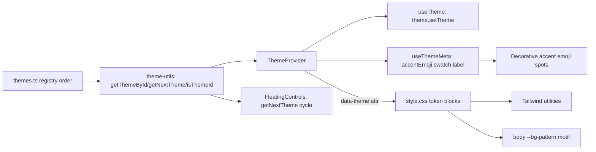

# Plan: Per-User Theme Moods

## Problem Statement

Add a fixed set of selectable visual "moods" (Summer, Sunset, Ocean, Forest, Night) chosen
per-device by each user. A mood changes the color palette, the background pattern motif + color, and a
decorative accent emoji in a few signature spots. Persisted in localStorage, cycled from
FloatingControls. Export is unaffected. Adding a 6th mood must require only data/CSS, never
application-logic changes.

## Requirements (confirmed)

- Per-user, per-device; persisted to localStorage; extends existing `summer`/`sunset` model.
- Palette + named mood + matching background motif + a decorative accent emoji (icon-level, not font
  family).
- Set: Summer, Sunset, Ocean, Forest, Night (5).
- Switcher in `FloatingControls`, beside language, cycling through moods — **cycle order derived from
  the registry, never hardcoded**.
- Export stays as-is.
- **Acceptance:** a 6th mood = one registry entry + one CSS block, with zero application-logic edits.

## Background (from code investigation)

- `ThemeProvider` exists (`summer`/`sunset`), sets `data-theme` on `<html>`, **not persisted**, resets
  on reload. No switcher UI currently mounted (only language in `FloatingControls`).
- Token-wiring bug in `style.css`: `@theme` defines `--color-*` literals while `[data-theme]`
  overrides a separate `--*` set, so Tailwind utilities (`bg-primary`, etc.) don't respond to theme.
  Must bridge `@theme` tokens to runtime vars first.
- Background motif is one line in `body`: `radial-gradient(var(--color-sand) 1px, …)`.
- Decorative emoji are split between component spots (e.g. `EmptyTimelineState` ✨) and baked into i18n
  strings (e.g. `timeline.headerTagline` "…✨"). Semantic emoji (📦 closed, 👋 quit) must NOT be
  themed.
- **Hardcoded-color audit (timeline):** only the heart colors are non-semantic — `HeartTooltip`
  `bg-rose-500`, `HeartButton` `text-rose-600`. The `red-*` usages (`QuitTeamDialog`, `TimelineHeader`
  quit item) are semantic-destructive and stay. The `views/timeline` view is already token-clean.
- `STORAGE_KEY` in `utils/constants.ts`; storage helper in `utils/storage.ts`. Tests use vitest + i18n
  parity, per existing `*.test.tsx` style.

## Proposed Solution

A single ordered theme registry is the source of truth (`{ id, labelKey, swatch, accentEmoji }`). A
thin theme-utility module (`getThemeById`, `getNextTheme`, `isThemeId`) centralizes all
lookup/cycle/validation logic; `ThemeProvider` and `FloatingControls` consume only these helpers — no
duplicated or hardcoded ordering. `ThemeProvider` exposes `useTheme()` → `{ theme, setTheme }` and a
separate `useThemeMeta()` → active metadata. `style.css` bridges `@theme` tokens to runtime vars, adds
a `[data-theme]` block per mood, and a `--bg-pattern` var (CSS-gradient first, SVG data-URI only if
needed). Decorative accent emoji come from `useThemeMeta().accentEmoji`.

## Task Breakdown

### Task 1: Fix token wiring so `data-theme` drives Tailwind utilities

- Objective: Make `data-theme` actually retint `bg-primary`/`text-surface`/`border-border`/etc.
- In `style.css`, point `@theme` color tokens at runtime vars (e.g. `--color-primary: var(--primary)`);
  ensure `:root` defines the full set utilities depend on (`--surface`, `--card`, `--border`,
  `--text`, `--text-h`, `--primary`, `--secondary`, `--accent`, `--color-sand` or its replacement).
- Test: manual — toggling `data-theme="sunset"` in devtools recolors the timeline (FAB, banners,
  header), not stray elements only.
- Demo: flipping `data-theme` live visibly retints the whole UI.

### Task 2: Theme registry + theme-utility module (+ unit tests)

- Objective: Single source of truth for themes and all lookup/cycle/validation logic.
- Add `src/components/theme/themes.ts`: ordered array of `{ id, labelKey, swatch, accentEmoji }` for
  summer, sunset, ocean, forest, night (`accentEmoji` explicitly decorative-only).
- Add `src/components/theme/theme-utils.ts`: `getThemeById(id)` (fallback to first/summer on miss),
  `getNextTheme(id)` (registry-order, wraps Night→Summer), `isThemeId(value)`.
- Test (vitest): valid lookup; invalid lookup → fallback; `isThemeId` true/false; `getNextTheme`
  advances in registry order and wraps Night→Summer.
- Demo: unit tests pass, proving cycle/validation behavior independent of any component.

### Task 3: New palettes + per-theme background motif in CSS

- Objective: Add Ocean/Forest/Night palettes and themed backgrounds.
- In `style.css`, add `[data-theme='ocean'|'forest'|'night']` token blocks (and keep summer
  default/sunset); introduce `--bg-pattern` with a per-theme motif and change `body` to
  `background-image: var(--bg-pattern)`.
- Implementation guidance: prefer lightweight CSS gradients/patterns; use SVG data-URI only where a
  gradient can't express the motif, and if used, validate Safari rendering and confirm desktop +
  mobile behavior.
- Test: manual — each `data-theme` yields a distinct palette + background across Chrome + Safari
  (desktop + mobile).
- Demo: all 5 values show visually distinct, cross-browser-correct moods.

### Task 4: Persisted ThemeProvider over the registry/utils (+ tests)

- Objective: Drive theme from registry, support all 5 ids, persist per-device, with refined API.
- Refactor `theme-provider.tsx`: `Theme` = registry ids; initialize from
  `storage.get(STORAGE_KEY.THEME)` (add the key) validated via `isThemeId`, else first registry theme;
  always set `data-theme` (incl. summer); persist on change; expose `useTheme()` → `{ theme, setTheme }`
  and `useThemeMeta()` → active metadata via `getThemeById`. Do **not** expose the raw registry entry
  through `useTheme`.
- Test (vitest): setting a theme persists to storage and reads back on re-mount; an invalid stored
  value falls back to summer; `useThemeMeta` returns the active entry.
- Demo: pick a mood, reload, mood persists; a corrupt stored value safely defaults.

### Task 5: Theme cycle button in FloatingControls + hardcoded-color cleanup (+ i18n)

- Objective: Let users switch moods, with cycling derived from the registry, and ensure themes recolor
  consistently.
- In `floating-controls.tsx`, add a button beside language that computes the next theme via
  `getNextTheme(theme)` (never a hardcoded order) and shows the active mood's swatch/`accentEmoji`;
  `aria-label` announces the next mood label.
- Add the 5 mood label keys to the `common` namespace, en + vi.
- Color cleanup (from audit): replace the heart rose classes (`HeartTooltip` `bg-rose-500`,
  `HeartButton` `text-rose-600`) with a theme token (introduce/reuse a `--heart`/accent token so the
  "love" color follows the mood); leave semantic-destructive `red-*` in `QuitTeamDialog`/
  `TimelineHeader` untouched.
- Test: manual — clicking cycles through all five in registry order and wraps; hearts retint per mood;
  build + i18n parity green.
- Demo: tapping the control rotates all five moods live, and heart UI recolors with the mood.

### Task 6: Themed decorative accent emoji in signature spots

- Objective: Reflect the mood via decorative emoji only (semantic emoji untouched).
- Render `useThemeMeta().accentEmoji` in `EmptyTimelineState` (replaces hardcoded ✨) and beside the
  timeline header tagline (move the baked ✨ out of `timeline.headerTagline` in both locales). Keep the
  change set small/decorative-only; leave 📦/👋 as-is.
- Test: manual — switching mood updates these emoji; i18n parity preserved after removing the baked ✨.
- Demo: changing mood swaps the empty-state and header accent emoji (e.g. Night → 🌙, Ocean → 🌊).

### Task 7: Final wiring + acceptance verification

- Objective: Integrate and prove the extensibility acceptance criterion.
- Confirm `ThemeProvider` still wraps the app (`App.tsx`); no leftover references to removed baked
  emoji; en/vi parity for new keys; `pnpm build` + `pnpm lint` + the new vitest suites green.
- Acceptance check: demonstrate (in the plan/PR notes) that adding a hypothetical 6th mood needs only
  one `themes.ts` entry + one `[data-theme]` CSS block — `FloatingControls`, `ThemeProvider`, and utils
  require no edits because cycling/lookup are registry-derived.
- Demo: full app builds; five moods selectable, persistent, consistent (palette + background + heart +
  accent emoji); adding a 6th is data/CSS-only.

## Notes

- Export (album PDF) intentionally untouched.
- Semantic emoji (📦, 👋) and semantic-destructive `red-*` deliberately excluded from theming.
- Testing is performed manually by the project owner for visual/UI items; vitest covers theme utils,
  persistence, invalid-value fallback, and cycle wrap-around.
