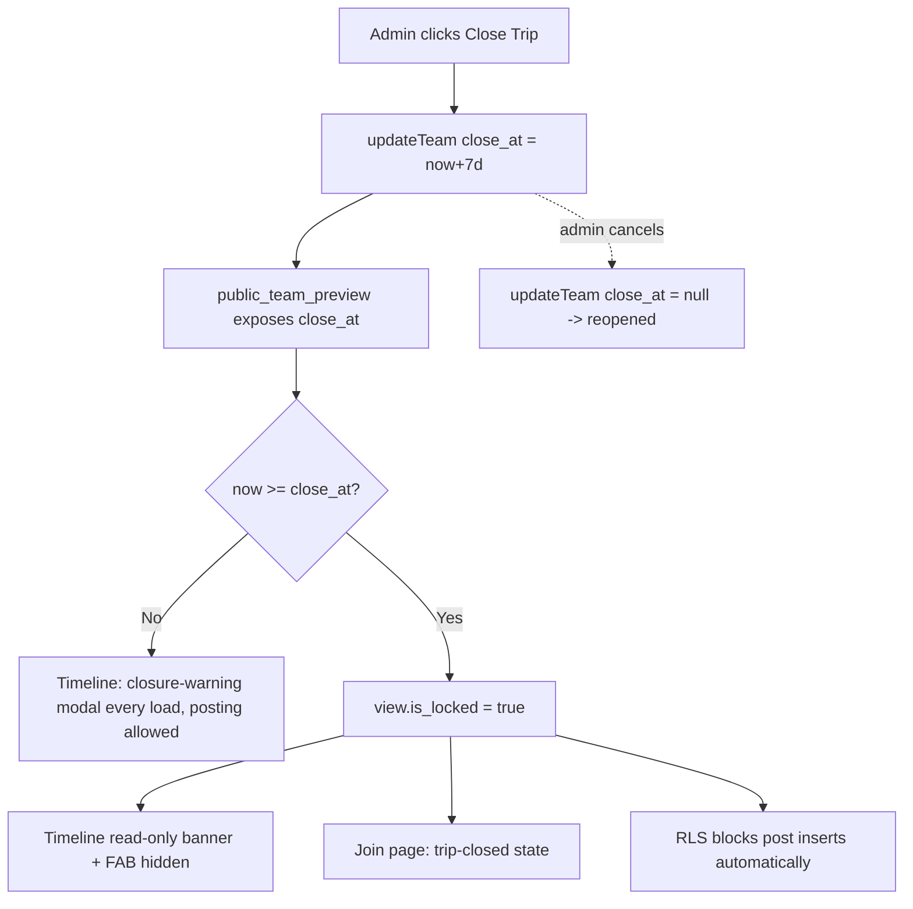

# Plan: Close Trip, Post Limits, Quick-Action Cleanup, Password Fix

## Problem Statement

Four changes:

1. Admin-scheduled 7-day trip closure with user-facing export nudge + post-close dialog.
2. Per-team post limit option on creation.
3. Remove the dead "Export PDF" button in admin Quick Actions.
4. Fix the broken edit-password flow.

## Requirements (confirmed)

- **Close:** Separate from the existing Lock toggle. Admin confirms close → schedules closure 7 days
  out. During the window the trip stays usable but the timeline shows a closure-warning modal **every
  load** nudging export. After 7 days the trip becomes read-only (view + export still work, posting
  blocked). Admin can **cancel** a pending close / reopen.
- **Closed access:** A user opening the trip via invite or direct link after closure sees a "trip has
  closed, contact admin" state (reuses the existing archived/locked join screen).
- **Enforcement:** Lazy evaluation in SQL — no cron. Admin manually initiates the close; the 7-day
  expiry flips the effective state automatically via the `public_team_preview` view.
- **Post limit:** Options 30 / 50 / 100 / Unlimited, chosen at team creation.
- **Export nudge:** No export-tracking; always show the nudge.

## Background (from code investigation)

- `teams` table: `id, name, invite_code, invite_password, is_locked, created_at`. No scheduling infra
  exists.
- Posting is a **direct client-side Supabase insert** gated by an RLS policy that checks
  `public_team_preview.is_locked = false`. So if the view's `is_locked` accounts for `close_at`,
  closure is enforced server-side for free.
- Admin reads/writes go through Netlify functions (`admin-teams-*`) using the service role; the admin
  sees raw `teams` columns.
- Join page already renders `ArchivedTeamState` when `is_locked` is true; timeline already shows a
  "closed" banner and hides the FAB when `is_locked`. Both automatically cover the post-closure state
  once the view reflects `close_at`.
- **Password bug root cause (confirmed):** in `team-detail-view.tsx`, `handleUpdate` sends
  `invite_password: password.trim() || undefined`. `JSON.stringify` drops `undefined` keys, and
  `admin-teams-update.ts` skips updates with `if (invite_password !== undefined)`. Result: a password
  can be set but **never cleared**. Fix = send explicit `null`.

## Proposed Solution

Add two nullable columns to `teams` (`close_at`, `post_limit`) and make `public_team_preview.is_locked`
a computed expression (`is_locked OR close_at <= now()`), exposing `close_at` and `post_limit` to the
client. This gives automatic, infra-free closure enforcement (including the existing posts-insert RLS
policy) while the admin keeps raw control. UI changes layer on top: an admin Close/Cancel action, a
create-team post-limit selector, a timeline closure-warning modal + post-limit guard, removal of the
dead Export PDF button, and the one-line password fix.

## Task Breakdown

> **Progress (last updated 2026-05-31):** Tasks 1–10 ✅ done.
> Note: migration `004` is written but applied to Supabase manually by the owner.

### Task 1: DB migration — columns + computed view ✅

Add `004_trip_close_and_post_limit.sql`:

- `alter table teams add column if not exists close_at timestamptz` and `post_limit int`.
- Recreate `public_team_preview` so `is_locked` =
  `(is_locked or (close_at is not null and close_at <= now()))` and it also selects `close_at` and
  `post_limit`.
- Re-grant select to `anon`.

**Demo:** setting `close_at` in the past on a team flips its public preview to locked and blocks new
posts.

### Task 2: Type + service plumbing ✅

- Add `close_at?: string | null` and `post_limit?: number | null` to `Team` (`team.service.ts`) and
  `PublicTeam` (`public-team.service.ts`).
- Add `close_at`/`post_limit` to `CreateTeamInput`/`UpdateTeamInput` (allow
  `invite_password: string | null`).
- Update `admin-teams-create.ts` and `admin-teams-update.ts` to accept/persist `close_at` and
  `post_limit`.

**Demo:** create + update calls round-trip the new fields without errors.

### Task 3: Fix edit-password bug ✅

- In `team-detail-view.tsx` `handleUpdate`, send `invite_password: password.trim() || null` (explicit
  null).
- Verify `admin-teams-update.ts` clears it (`null !== undefined` → `updates.invite_password = null`).

**Demo:** admin clears a team password and the protected badge disappears.

### Task 4: Remove dead Export PDF button ✅

- Delete the disabled "Export PDF / Coming soon" button block in the Quick Actions grid of
  `team-detail-view.tsx` (adjust grid layout).

**Demo:** Quick Actions no longer shows Export PDF.

### Task 5: Admin Close Trip / Cancel action

- In `team-detail-view.tsx` Quick Actions, add a button driven by team state:
  - no/expired `close_at` → "Close Trip" (ConfirmDialog → `updateTeam({ close_at: dayjs().add(7,'day').toISOString() })`).
  - `close_at` set & future → "Cancel scheduled close" (`updateTeam({ close_at: null })`); show
    scheduled date.
  - Provide reopen (clear `close_at` + `is_locked`) when closed.

**Demo:** admin schedules a close, sees the date, and cancels it.

### Task 6: Timeline closure-warning modal

- New `ClosureWarningModal` (reuse `Modal`) shown on every timeline load when `team.close_at` is set
  and in the future; message includes the close date and a button linking to `/export`.
- Wire into `views/timeline/index.tsx`.
- Add `timeline.json` keys (en + vi).

**Demo:** a trip scheduled to close shows the export-nudge modal on the timeline.

### Task 7: Post-limit selector on create

- Add a 30/50/100/Unlimited selector to `create-team-sheet.tsx`; pass `post_limit` (null for
  unlimited) through `handleCreateTeam` → `createTeam`.

**Demo:** create a team capped at 30 posts and confirm the value is stored.

### Task 8: Enforce post limit on timeline

- In `views/timeline/index.tsx`, when `team.post_limit` is set and
  `stats.memory_count >= post_limit`, disable the FAB and show a "limit reached" message (new
  `timeline.json` keys, en + vi).
- Server-side RLS enforcement of the count is noted as optional hardening, kept out of minimal scope to
  match the app's existing client-trust model.

**Demo:** a 30-post-capped trip blocks the share button once full.

### Task 9: Verify closed-access wording on join/timeline

- Confirm the post-closure state surfaces correctly through the existing `ArchivedTeamState` (join)
  and "closed" banner (timeline) now that the view drives `is_locked`.
- Adjust the `join.json` `archived.contact` copy if needed to read "contact admin for help" (en + vi).

**Demo:** opening a closed trip's invite link shows the "trip closed — contact admin" screen.

### Task 10: Final wiring + build pass

- Run `pnpm` build and i18n parity check; ensure no orphaned references to the removed button and both
  locales stay in parity.

**Demo:** full build green with all four features integrated.

## Notes

- Testing is performed manually by the project owner (test tasks intentionally omitted from this plan).
